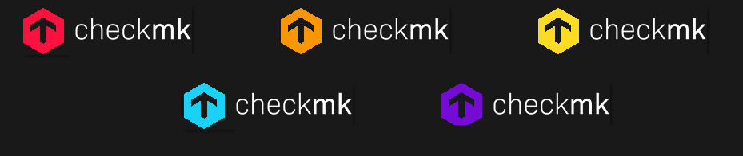
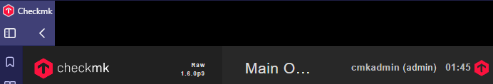

# Custom Themes for Check_MK RAW/CRE

> **Note:** ⚠️ This solution works only for Check_MK version 1.6.0p30 and below. ⚠️

## Table of Contents

- [Introduction](#introduction)
- [Installation](#installation)
- [Example](#final-result)

## Introduction
Welcome to the repository for custom themes for Check_MK RAW/CRE. This project provides a set of visually appealing icons designed to enhance the default icon set, helping users distinguish between multiple instances by using different colors.

## Installation

To install and apply the custom icon theme, follow these steps:

1. **Backup Your Current Theme located at**
    ```
    /opt/omd/versions/<version>/share/check_mk/web/htdocs/themes/<default-theme>/images
    ```

2. **Download the Custom Theme**  
    Download the custom theme files from this repository.
3. **Choose Your Color Theme**  
    Select the color theme folder you wish to use
4. **Overwright the default files**
5. **Restart Check_MK**
    After copying the files, restart Check_MK to apply the changes.
    ```bash
    omd restart
    ```

## Final result


